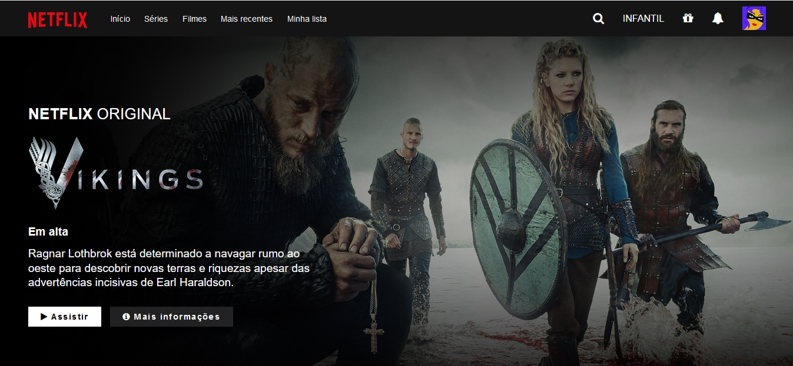

# 🖥 Interface da Netflix 

## 📱 Resultado de como ficou 

## 🚀 Tecnologias 
Esse projeto foi desenvolvido com as seguintes tecnologias: HTML5, CSS3.

## 🌳 Observação 
Fiz a interface da Netflix, porém sem os slides. O objetivo foi treinar o os itens em flex no CSS.

## 💻 Projeto 
Um clone da interface da Netflix com HTML5 e CSS3.
